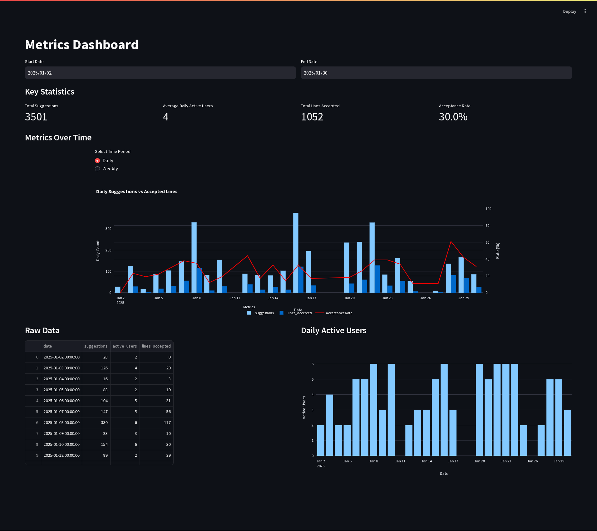

# GitHub Copilot Dashboard

GitHub Copilot Dashboard is a visual interface to monitor and analyze GitHub Copilot metrics.
<p align="left">

</p>

## Clone Copilot Dashboard Project
- With HTTPS:
`git clone https://github.com/arcadea-ai/copilot-dashboard.git`
- With SSH:
`git clone git@github.com:arcadea-ai/copilot-dashboard.git`
<br>
Then `cd` to `src` folder

## Setup Project

Follow these steps to set up and run the dashboard:

### 1. Set Up Python Environment

You can use either `venv` (built-in to python) or `conda` (Anaconda) to create an isolated Python environment.

**Option 1: Install Python 3.10** 
Download from: [python.org](https://wiki.python.org/moin/BeginnersGuide/Download)  
Install and check:  
```sh
python3.10 --version
```
Or you can go with Anaconda

**Option 2: Install Anaconda**
Download from: [anaconda.com](https://www.anaconda.com/docs/getting-started/anaconda/install)
Install and check:  
```sh
conda --version
```
```sh
conda init
```
Now close the PowerShell and start a new one

#### Using `venv` (Python 3.10)
```sh
python3.10 -m venv venv
source venv/bin/activate  # On macOS/Linux
venv\Scripts\activate     # On Windows
```

#### Using Conda
```sh
conda create --name copilot-dashboard python=3.10
conda activate copilot-dashboard
```

### 2. Install Dependencies
- Navigate to the `src` directory (Skip this if you already in `src` folder)
- Install the required packages:
```sh
cd src
pip install -r requirements.txt
```

### 3. Configure Environment Variables
Create a .env file inside the src directory and add the following:
```sh
GITHUB_API_KEY=<your_personal_access_token>
GITHUB_ORG_NAME=<your_github_org_name>
GITHUB_API_VERSION=<github_api_version> # Default is 2022-11-28
```
### 4. Enable GitHub Copilot Metric API

Ensure that the GitHub Metric API is enabled for your organization:

1. Go to **Organization settings**.
2. Navigate to **Copilot**.
3. Click on **Policies**.
4. Enable **Copilot Metrics API access**.


### 5. Generate a GitHub API Key
Follow these steps to generate a GitHub API key:

1. Click on your profile icon in the top-right corner of GitHub.
2. Go to **Settings**.
3. Navigate to **Developer Settings**.
4. Select **Personal Access Tokens**.
5. Click **Generate new token**.
6. Grant the following permissions:
   - `manage_billing:copilot`
   - `read:org`
   - `read:enterprise`
7. Generate and copy the token.
8. Paste it into the `.env` file as:

```env
GITHUB_API_KEY=your_generated_token_here
```
### 6. Run the Dashboard
Launch the Streamlit dashboard with bellow command:
```sh
streamlit run app.py
```
The dashboard should now be accessible in your browser under `http://localhost:8501` with default configurations.